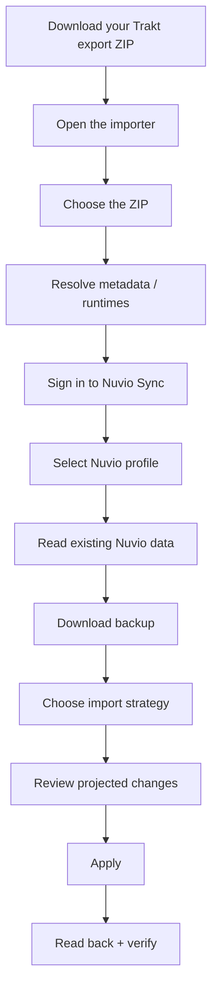

# Trakt → Nuvio Sync Importer

<p align="center">
  <strong>A private, browser-only migration and repair tool for moving Trakt tracking data into Nuvio Sync.</strong>
</p>

<p align="center">
  
  
  
  
</p>

<p align="center">
  <a href="https://yungzanji.github.io/nuvio-trakt-importer/"><strong>Open the importer</strong></a>
  ·
  <a href="CHANGELOG.md">Changelog</a>
  ·
  <a href="PRIVACY.md">Privacy</a>
  ·
  <a href="SECURITY.md">Security</a>
</p>

> **Version 1.2.0:** the importer now supports four selectable merge strategies, a verified fresh-start workflow, and a standalone TMDB artwork repair tool for existing Nuvio libraries.

---

## What problem does this solve?

Nuvio can connect to Trakt directly, but a normal account sync may not always reproduce a large Trakt history exactly. This project gives you another route: download your own Trakt export ZIP, process it locally in your browser, preview how it will interact with your existing Nuvio Sync data, and then write the selected result through Nuvio's Sync functions.

It is especially useful when:

- a normal Trakt-to-Nuvio sync only imports part of a large history;
- you want to migrate from Trakt without leaving the Trakt account connected;
- you already use Nuvio and need to merge imported data without destroying newer Nuvio activity;
- you want Nuvio to mirror the Trakt export more closely;
- you want to wipe only the supported Nuvio tracking categories and rebuild them cleanly;
- posters or backgrounds in an existing Nuvio Library are missing or broken and you want to refresh them through TMDB without re-importing Trakt.

## What it can move

| Trakt data | Nuvio destination | Notes |
| --- | --- | --- |
| Watchlist | Library | Includes metadata/artwork enrichment when available |
| Watched movies | Watched status | Latest relevant timestamp is retained |
| Watched episodes | Watched status | Stored by show + season + episode |
| Playback / progress | Continue Watching | Trakt percentage is converted to milliseconds using runtime metadata |

Trakt ratings, social activity, and independent personal-list membership do not currently map cleanly to Nuvio Sync's supported schema. They remain preserved in the original Trakt ZIP instead of being forced into the wrong category.

---

# Choose the right import strategy

Version 1.2.0 reads your existing Nuvio data first and lets you choose how the imported Trakt set should interact with it.

| Strategy | Best for | Existing Nuvio items | Missing-from-Trakt items |
| --- | --- | --- | --- |
| **Only bring new items** | Safest possible import | Left exactly as-is | Kept |
| **Merge & refresh** | Most users | Useful metadata refreshes; newer watched/progress timestamps win | Kept |
| **Mirror the Trakt import** | Making Nuvio closely match the export | Matching records are updated | Removed from the supported tracking categories |
| **Reset tracking data & import fresh** | Starting the supported tracking categories over | Library, watched status and Continue Watching are cleared and verified first | Rebuilt from Trakt |

### Recommended: Merge & refresh

This is the default choice for most people. It adds missing Trakt records while protecting newer activity that may already exist in Nuvio. Existing Library metadata can be refreshed when the imported/metadata-resolved version provides something useful, while watched and Continue Watching timestamps use the newer value.

### Safe: Only bring new items

Use this when you treat Nuvio as the primary source of truth and only want to fill gaps from Trakt. Existing matching records are not overwritten and nothing is deleted.

### Advanced: Mirror the Trakt import

Use this when the Trakt export should be the source of truth for the three supported tracking categories.

Before any watched-status or Continue Watching removals are allowed to begin, the importer writes the requested Library state and reads it back. If Nuvio does not produce the requested Library mirror, the destructive portion stops.

### Danger: Reset tracking data & import fresh

This clears only the tracking categories managed by this importer:

- Nuvio Library
- watched status
- Continue Watching

It does **not intentionally target** your Nuvio profile, add-ons, plugins, account, or unrelated profile settings.

The workflow is deliberately staged:

1. Download the mandatory pre-change backup.
2. Clear the Library and verify it is actually empty.
3. Clear watched status and Continue Watching and verify those are empty.
4. Rebuild the three supported categories from the Trakt export.
5. Read everything back and verify the final result.

The importer stops when an expected destructive step cannot be verified instead of blindly continuing.

---

# Artwork repair without a Trakt import

You can use the site purely as a Nuvio artwork repair utility. No Trakt ZIP is required.

The repair flow:

1. Sign in to Nuvio Sync.
2. Select and read the Nuvio profile.
3. Download the mandatory backup.
4. Paste your own **TMDB API Read Access Token** into the repair field.
5. Run **Repair existing artwork**.

For compatible Library items, the importer asks TMDB for current poster and background paths and writes only those artwork fields back to Nuvio. It does not intentionally change Library membership, watched status, Continue Watching, or tracking timestamps.


---

# Typical use cases

### "Nuvio's normal Trakt import only brought over part of my history"

Download the Trakt export ZIP and use **Merge & refresh**. The importer parses the exported files directly rather than depending on the live Trakt connection to enumerate everything during the migration.

### "I already have newer activity in Nuvio"

Use **Merge & refresh**. New Trakt records are added, but newer Nuvio watched/progress timestamps are preserved.

### "I don't trust anything to overwrite my current Nuvio records"

Use **Only bring new items**.

### "I want Nuvio to reflect the exported Trakt set"

Use **Mirror the Trakt import**. Review the projected add/update/remove counts carefully before applying it.

### "My current Nuvio tracking data is a mess and I want to start over"

Use **Reset tracking data & import fresh** after downloading the backup. The importer verifies each clear stage before rebuilding.

### "My posters are broken but my tracking data is fine"

Skip the Trakt ZIP and use **Repair existing artwork** with your own TMDB token.

---

# How to use it



### Step 1: Export from Trakt

Use Trakt's data-export feature and keep the original ZIP. The importer reads the JSON files inside the archive directly in your browser.

### Step 2: Resolve metadata

TMDB is recommended because it can provide reliable poster/background paths and runtime metadata. Cinemeta remains available as a fallback for supported metadata/runtime lookups.

### Step 3: Sign in to Nuvio

The page uses Nuvio's TV-style approval flow. The Nuvio access token exists only in the current page memory and is discarded when the page closes or refreshes.

### Step 4: Read Nuvio and download the backup

The importer reads the selected profile before enabling writes. A pre-change JSON backup is mandatory.

### Step 5: Pick a strategy and review the preview

The interface shows projected changes for:

- Library
- watched status
- Continue Watching

including how many records will be added, updated, removed, and remain after the operation.

### Step 6: Apply and verify

After writing, the importer pulls Nuvio Sync again and compares the result against the selected strategy. A successful screen means the expected keys were found after the operation.

---

# Metadata and artwork

The lookup order is intentionally conservative:

1. **TMDB first, recommended** for posters, backgrounds, title metadata, and runtime. Each user supplies their own TMDB API Read Access Token.
2. **Cinemeta fallback** when TMDB is not used or cannot resolve an item. MetaHub artwork URLs are intentionally discarded.
3. **Manual runtime fallback** when neither provider can resolve the runtime needed for Continue Watching conversion.

TMDB-only Trakt records are supported. For TV Continue Watching entries, the importer uses individual episode runtime when TMDB provides it.

## Why MetaHub artwork is rejected

Some Nuvio users reported MetaHub-hosted poster URLs failing to load reliably on their devices or networks. Cinemeta can still provide useful metadata/runtime information, but this importer refuses to persist MetaHub artwork URLs into Nuvio.

## Your TMDB credential

Use the **API Read Access Token** from your own TMDB account.

The importer does not save it in cookies, `localStorage`, `sessionStorage`, IndexedDB, a database, or a file. During metadata or artwork repair, it is sent directly from your browser to `api.themoviedb.org` in the authorization header and is cleared from the page/in-memory state when the operation finishes.

TMDB authentication documentation: <https://developer.themoviedb.org/docs/authentication-application>

---

# Privacy model

The application is a static HTML page. It has no project application server, database, analytics, advertising, cookies, or browser storage.

| Data | Where it goes |
| --- | --- |
| Trakt ZIP contents | Browser memory only; never uploaded by the importer |
| Nuvio approval code/account token | Directly between your browser and Nuvio; held in memory |
| Existing and converted Nuvio records | Directly between your browser and Nuvio Sync |
| Your TMDB API Read Access Token | Directly from your browser to TMDB during the requested lookup/repair |
| Public TMDB/IMDb IDs and episode coordinates | To the metadata provider required for the lookup |
| Site request metadata | GitHub Pages may receive normal web-hosting request logs |

The Trakt ZIP, Nuvio token, watch timestamps, ratings, playback percentages, and account data are not sent to TMDB or Cinemeta by the importer.

Google Sans Flex is bundled into the generated HTML, so loading the app does not need Google Fonts. See [PRIVACY.md](PRIVACY.md) for the full disclosure.

---

# Safety controls

- Mandatory pre-change backup before write operations.
- Typed confirmation for **Mirror** and **Fresh reset**.
- Read-back verification after imports and artwork repair.
- Fresh reset verifies each clear stage before rebuilding.
- Mirror verifies the Library result before watched/progress removals.
- Exact-hash Content Security Policy for the inline application bundle.
- Network connections restricted to Nuvio, TMDB, and the consent-gated Cinemeta fallback.
- No third-party runtime JavaScript, analytics, service workers, or browser storage APIs.
- Bundle tests verify that TMDB credentials are not embedded or persisted.

---

# Run locally

The local build uses the same browser-only architecture as the hosted page.

```sh
npm ci
npm run build
npm test
npm run verify:bundle
```

Then open the generated `index.html` or `Nuvio-Trakt-Importer.html` in a current browser.

The generated page is self-contained, including the ZIP parser and bundled font. There is no application server to configure.
---

# Version history

See [CHANGELOG.md](CHANGELOG.md) for user-facing release notes.

Current release: **v1.2.0**

Built against `NuvioMedia/NuvioTV` commit `a4e0c71678dc8364a4bf2175e8fa96c641da41d9`.

This is an independent community project and is not affiliated with or endorsed by Nuvio, Trakt, or TMDB.

This product uses the TMDB API but is not endorsed or certified by TMDB.

## License

Application code: [MIT License](LICENSE)  
Google Sans Flex: [SIL Open Font License 1.1](FONT-LICENSE.txt)  
Other bundled notices: [THIRD_PARTY_NOTICES.txt](THIRD_PARTY_NOTICES.txt)
