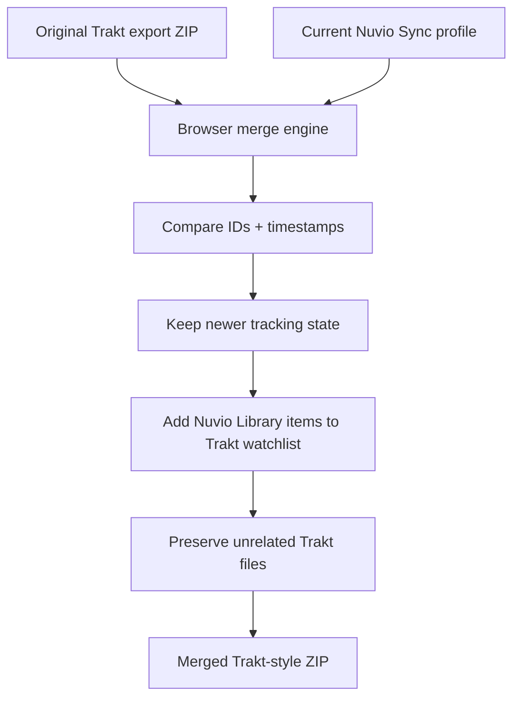

# Trakt ↔ Nuvio Sync Migration Tool

<p align="center">
  <strong>A private, browser-only migration, merge, and repair tool for Trakt exports and Nuvio Sync.</strong>
</p>

<p align="center">
  
  
  
  
</p>

<p align="center">
  <a href="https://yungzanji.github.io/nuvio-trakt-importer/"><strong>Open the migration tool</strong></a>
  ·
  <a href="CHANGELOG.md">Changelog</a>
  ·
  <a href="PRIVACY.md">Privacy</a>
  ·
  <a href="SECURITY.md">Security</a>
</p>

---

## What it does

The site now has two separate workflows:

| Direction | Purpose |
| --- | --- |
| **Trakt → Nuvio** | Import a Trakt export ZIP into Nuvio Sync with safe merge, mirror, or reset strategies. |
| **Nuvio → Trakt** | Merge newer Nuvio Library, watched-state, and Continue Watching data back into an original Trakt export ZIP. |

Both workflows run in the browser. The project has no application server, database, analytics, cookies, or persistent browser storage.

The original Trakt ZIP is never uploaded by this tool.

---

# Trakt → Nuvio

This is the original importer workflow. It is useful when Nuvio's normal Trakt connection does not reproduce a large history completely, or when you want a controlled migration using the files in your own Trakt export.

## Supported mappings

| Trakt data | Nuvio destination | Notes |
| --- | --- | --- |
| Watchlist | Library | Includes metadata/artwork enrichment when available |
| Watched movies | Watched status | Relevant timestamps are retained |
| Watched episodes | Watched status | Stored by show + season + episode |
| Playback / progress | Continue Watching | Trakt percentage is converted to milliseconds using runtime metadata |

Ratings, social activity, and independent personal-list membership are not forced into unrelated Nuvio fields. They remain in the original Trakt ZIP.

## Import strategies

After reading the selected Nuvio profile, the importer previews the changes before writing anything.

| Strategy | Behavior |
| --- | --- |
| **Only bring new items** | Adds missing Trakt records without overwriting matching Nuvio records. |
| **Merge & refresh** | Adds missing records and keeps the newer watched/progress timestamp. Recommended for most migrations. |
| **Mirror the Trakt import** | Makes the supported Nuvio tracking categories reflect the Trakt import more closely. |
| **Reset tracking data & import fresh** | Clears Library, watched status, and Continue Watching, verifies the clear, then rebuilds them from Trakt. |

Destructive modes require explicit typed confirmation and read-back verification.

## Artwork repair

The site can also repair poster/background URLs in an existing Nuvio Library without performing a Trakt import.

The user supplies their own TMDB API Read Access Token. The token is kept only in page memory during the lookup and is cleared afterward.

---

# Nuvio → Trakt

The reverse exporter is designed for the case where Trakt was your old tracker, you later used Nuvio as your source of truth, and you now want an updated Trakt-style archive containing the newer Nuvio tracking state.

It requires:

1. Your original Trakt export ZIP.
2. A Nuvio Sync sign-in.
3. The Nuvio profile you want to merge.

No Trakt API key, Trakt OAuth login, or Trakt application credentials are required to generate the merged archive.

## Reverse merge rules

The original Trakt export remains the historical base.

### Nuvio Library → Trakt Watchlist

Every Nuvio Library item that is not already represented in the Trakt watchlist is added to the Trakt watchlist.

This applies to both movies and TV shows. Nuvio Library items are deliberately treated as **watchlist items**, not Collection items or custom-list entries.

The existing Trakt watchlist is retained, so the result is a union rather than a destructive mirror.

### Watched state

For each movie or episode, the tool compares the latest known Trakt watched timestamp with the Nuvio watched timestamp.

- If Trakt is newer or equal, the Trakt state is retained.
- If Nuvio is newer, a new watched event is added to the Trakt history and the appropriate watched summary is updated.
- Older Trakt history events remain in the archive.

This means a title started or tracked earlier in Trakt but finished later in Nuvio will end with the newer Nuvio watched state represented in the merged archive.

### Continue Watching / playback

Nuvio stores playback position and duration in milliseconds. The exporter converts those values back into a Trakt playback percentage.

For the same movie or episode:

- the newest pause timestamp wins;
- an older Nuvio progress value cannot overwrite newer Trakt playback;
- a newer Nuvio progress value can replace older Trakt playback;
- if the item was subsequently marked watched, stale playback from before that watched timestamp is removed.

### Trakt-only data

Ratings, custom lists, social data, preferences, and other unrelated Trakt export files are left alone.

Files that do not need a watch-history-related change are copied into the new ZIP without being rewritten. Only the tracking files that actually require a merge are regenerated.

## ID matching

The reverse exporter reconciles supported IMDb, TMDB, Trakt, and TVDB identifiers found in the original archive. This helps avoid duplicate records when Nuvio identifies an item using a different supported public ID than the one that appears first in the Trakt record.

## Important replay limitation

Nuvio Sync exposes the current watched state and latest watched timestamp; it does not provide this tool with a complete event-by-event replay history.

If you watched the same movie or episode multiple times after leaving Trakt, the exporter can preserve the newest known watched state, but it cannot reconstruct every missing replay event that Nuvio never stored separately.

---

# Reverse-export workflow



Before download, the UI shows projected counts for:

- Nuvio Library items being added to the Trakt watchlist;
- newer watched states being added;
- playback positions being added or updated;
- stale playback positions being removed because a later watched state exists;
- final watch-history, watchlist, and playback counts.

---

# Nuvio Sync access

The browser uses Nuvio's TV-style approval flow and the Sync functions exposed to the approved session.

The current implementation reads:

- profiles;
- Library;
- watched movie/episode states;
- Continue Watching / playback state.

The reverse exporter is read-only with respect to Nuvio. It never writes back to the selected Nuvio profile.

---

# Privacy model

| Data | Where it goes |
| --- | --- |
| Trakt ZIP contents | Browser memory only; never uploaded by this project |
| Nuvio approval/session token | Directly between the browser and Nuvio; held in memory |
| Nuvio tracking records | Directly between the browser and Nuvio Sync |
| User-supplied TMDB token | Directly from the browser to TMDB during requested metadata/artwork lookup |
| Public media IDs / episode coordinates | Metadata provider only when a metadata lookup is requested |
| Site request metadata | GitHub Pages may receive normal web-hosting request logs |

The application does not intentionally store credentials or tracking data in cookies, `localStorage`, `sessionStorage`, IndexedDB, an application database, or an application server.

Google Sans Flex is bundled into the generated HTML, so the application does not need Google Fonts at runtime.

See [PRIVACY.md](PRIVACY.md) for the complete disclosure.

---

# Safety controls

For Trakt → Nuvio writes:

- mandatory pre-change backup;
- projected change preview;
- typed confirmation for destructive strategies;
- staged clears for fresh reset;
- read-back verification after writes;
- operations stop when expected destructive steps cannot be verified.

For Nuvio → Trakt export:

- Nuvio is read-only;
- the original Trakt ZIP is not modified on disk;
- a new ZIP is generated as a separate download;
- unrelated Trakt files are preserved;
- only newer Nuvio state is allowed to supersede older tracking state.

The generated application bundle uses a hash-based Content Security Policy and restricts network connections to the services needed by the selected workflow.

---

# Run locally

```sh
npm ci
npm run build
npm test
npm run verify:bundle
```

Then open the generated `index.html` or `Nuvio-Trakt-Importer.html` in a current browser.

The generated page is self-contained, including the ZIP parser and bundled font. There is no application server to configure.

---

# License

Application code: [MIT License](LICENSE)  
Google Sans Flex: [SIL Open Font License 1.1](FONT-LICENSE.txt)  
Other bundled notices: [THIRD_PARTY_NOTICES.txt](THIRD_PARTY_NOTICES.txt)

This is an independent community project and is not affiliated with or endorsed by Nuvio, Trakt, or TMDB.
